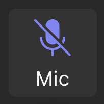

# Microsoft Teams global mute shortcut for macOS

  
  &nbsp;&nbsp;
  

Toggle mute in Microsoft Teams from any macOS app using the built-in Shortcuts app. The shortcut briefly focuses Teams, sends its mute command, then restores the app you were using.

No extra software, background service, or microphone access is required.

## Requirements

- macOS with the Shortcuts app
- The current Microsoft Teams desktop app (`com.microsoft.teams2`)
- Teams' **Toggle mute** shortcut set to **Shift-Command-M**

## Set up

1. Open **Shortcuts** and create a new shortcut named `Toggle Teams Mute`.
2. Add the **Run AppleScript** action.
3. Paste the contents of [`toggle-teams-mute.applescript`](toggle-teams-mute.applescript) into the action.
4. Open the shortcut's **Details** panel.
5. Enable **Use as Quick Action** and set it to receive **no input**.
6. Add a keyboard shortcut. For example, **Control-Shift-Command-A**.
7. Run it once and allow **Shortcuts** under **System Settings → Privacy & Security → Accessibility**.

Join a Teams meeting and use the keyboard shortcut from another app. Teams should toggle mute and return focus to the previous app.

## How it works

The AppleScript:

1. Records the process ID of the active app.
2. Activates Microsoft Teams by its bundle ID.
3. Sends Teams' **Shift-Command-M** mute command.
4. Restores the previous app by process ID.

Using the process ID avoids macOS trying to locate an application whose process name does not match its application name.

## Troubleshooting

### Teams focuses but mute does not change

Open **Teams → Settings and more → Keyboard shortcuts** and confirm **Toggle mute** is assigned to **Shift-Command-M**. Shortcut presets can change Teams' key assignments. Fully quit and reopen Teams after changing the preset or shortcut.

Microsoft documents **Shift-Command-M** as the macOS mute toggle in its [Teams keyboard shortcut reference](https://support.microsoft.com/en-us/accessibility/teams/keyboard-shortcuts-for-microsoft-teams).

### “Shortcuts is not allowed to send keystrokes”

Open **System Settings → Privacy & Security → Accessibility** and enable **Shortcuts**. If it is already enabled, turn it off and on again, then restart Shortcuts.

### Teams asks macOS to locate an application

Use the current script from this repository. It restores the previous app by process ID instead of treating the process name as an application name.

## Limitations

- Teams must be running with a meeting or call open.
- Teams briefly receives focus because it does not expose a system-wide mute API on macOS.
- The script targets the current Teams desktop app. Classic Teams uses a different bundle ID.
- The global keyboard shortcut is configured in Shortcuts, not in the AppleScript.

## Privacy

The script does not access audio, meeting content, files, or the network. macOS Accessibility permission is required only so Shortcuts can identify the active app, send the Teams keystroke, and restore focus. The complete automation is the readable AppleScript in this repository.

## License

[MIT](LICENSE)
