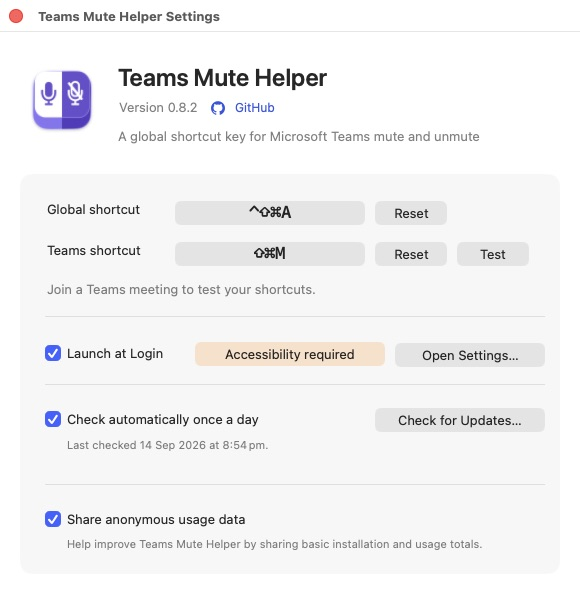

# Microsoft Teams global mute shortcut for macOS

<p align="center">
  
</p>

Toggle mute in Microsoft Teams from anywhere in macOS with a configurable global keyboard shortcut. The default is **⌃⇧⌘A**.

Teams Mute Helper is a tiny open source native menu bar app. It owns both the global hotkey and Accessibility permission, so the app you are working in never becomes part of the permission chain.

The helper can launch at login and remains idle until the hotkey is pressed. It has no microphone access. Network use is limited to update checks and the optional anonymous usage sharing described below.

<p align="center">
  
</p>

## Requirements

- macOS 13 or later
- The current Microsoft Teams desktop app (`com.microsoft.teams2`)
- A Teams keyboard shortcut assigned to **Toggle mute** (the helper defaults to Teams' standard **⇧⌘M**)

## Set up

### 1. Install the helper

#### Homebrew

```sh
brew trust m-rk/tap
brew tap m-rk/tap
brew install --cask teams-mute-helper
```

Older Homebrew versions that do not have `brew trust` can skip the first command.

Or download the latest signed build from [GitHub Releases](https://github.com/m-rk/ms-teams-mute-shortcut/releases/latest), unzip it, and move **Teams Mute Helper.app** to your Applications folder.

Open the app once. Its menu bar icon appears and its native macOS login item is enabled automatically.

If macOS says the login item needs approval, open **System Settings → General → Login Items & Extensions** and enable Teams Mute Helper.

#### Build from source

Install Xcode Command Line Tools (`xcode-select --install`), clone or download this repository, then run:

```sh
./install-helper.sh
```

This creates an ad-hoc signed universal build in `~/Applications`. Because its signature is local to your Mac, Accessibility permission may need to be reset after rebuilding it.

### 2. Customise your shortcuts

The helper's Settings window allows you to remap both the global shortcut and the Teams app shortcut.

### 3. Allow Accessibility access

When prompted, allow Teams Mute Helper to control your computer. You can also open **System Settings → Privacy & Security → Accessibility**, add Teams Mute Helper from your Applications folder, and enable it.

Accessibility is used only to locate the active Teams meeting, deliver Teams' own mute shortcut, verify the result, and restore your previous app.

### 4. Choose update behaviour

Automatic daily update checks are enabled by default and can be turned off in Settings. **Check for Updates…** performs a manual check at any time. The helper reports when a newer GitHub release is available but does not install it automatically.

If you installed with Homebrew, update and reopen the helper with:

```sh
brew update
brew upgrade --cask m-rk/tap/teams-mute-helper
open -a "Teams Mute Helper"
```

Your shortcuts and other settings are preserved. If you installed from GitHub Releases, download the new archive and replace the existing app in Applications.

### 5. Choose usage sharing

**Share anonymous usage data** is checked on first launch. Nothing is sent until you close the onboarding window, giving you a chance to turn it off first. The setting remains available in Settings and can be changed at any time.

When enabled, the helper sends an anonymous installation event and daily aggregate usage totals to TelemetryDeck. See [Privacy](#privacy) for the exact data included.

### 6. Try it

Join a Teams meeting and press your global shortcut from another app. Teams should toggle mute and return focus to the previous app.

### Upgrading an older version

Shortcuts is not required by the native helper. Remove the global key combination from the old `Toggle Teams Mute` shortcut—or delete that shortcut—so it does not conflict with the helper.

If you previously installed the source-built helper, update the repository and run `./install-helper.sh --uninstall` once before installing the signed release or Homebrew cask. This removes its old LaunchAgent so the native login item is the only copy that starts.

## How it works

1. A native macOS login item starts Teams Mute Helper.
2. The helper registers your saved shortcut directly with macOS.
3. When pressed, it finds the active Teams meeting and reads whether the microphone control says **Mute mic** or **Unmute mic**.
4. When you release the shortcut's main key, it sends your configured Teams shortcut directly to the Teams process.
5. It verifies the mic state as soon as it changes and returns to waiting.

If background delivery does not change the mic state, the helper retries with macOS Accessibility keyboard delivery. Only if both targeted methods fail does it wait for any held modifier keys, briefly bring Teams forward, and retry with system HID delivery before restoring the previous app. It verifies the microphone state after each attempt, so a successful attempt is not toggled a second time. Overlapping hotkey presses are ignored while a toggle is running.

Because the persistent helper receives the global hotkey itself, Shortcuts, Services, Finder, browsers, and editors do not execute the Accessibility automation.

## Menu bar controls

Click the helper's icon to:

- toggle Teams mute without using the keyboard;
- open Settings to manage both shortcuts, anonymous usage sharing, update checks, login behaviour, and Accessibility;
- check for updates;
- enable Launch at Login;
- open Accessibility settings; or
- quit the helper. Open **Teams Mute Helper** from Applications to start it again.

## Troubleshooting

### The global hotkey does nothing

Check the menu bar for Teams Mute Helper. If its icon is missing, open the app from Applications. For a source build, re-run:

```sh
./install-helper.sh
```

Also remove the chosen key combination from any old Shortcuts shortcut or other hotkey utility. The helper shows a warning icon when macOS reports that the combination is already registered. If a new shortcut conflicts, the helper rejects it and keeps the previous working shortcut.

### Accessibility is enabled, but the helper is not trusted

Turning the entry off and on is sometimes enough. If it is not, fully reset only the helper's Accessibility record:

```sh
tccutil reset Accessibility io.github.m-rk.ms-teams-mute-helper
```

Then return to **System Settings → Privacy & Security → Accessibility**, add Teams Mute Helper from Applications again, and enable it.

Official releases keep the same Developer ID signature across updates. Locally rebuilding and ad-hoc signing the app can require this reset after an update.

### Teams focuses but mute does not change

Open **Teams → Settings and more → Keyboard shortcuts** and find **Toggle mute**. Confirm that its combination matches **Teams shortcut** in the helper's Settings. Fully quit and reopen Teams after changing its shortcut preset, then use **Test** in the helper.

Microsoft documents **⇧⌘M** as the macOS mute toggle in its [Teams keyboard shortcut reference](https://support.microsoft.com/en-us/accessibility/teams/keyboard-shortcuts-for-microsoft-teams).

### A Run/Quit window appears

That is the old AppleScript applet. Pull the latest version and re-run `./install-helper.sh`. The current helper is a native menu bar app.

### Collect a local diagnostic

Run the helper without toggling the microphone:

```sh
"/Applications/Teams Mute Helper.app/Contents/MacOS/TeamsMuteHelper" --diagnose
tail -20 ~/Library/Logs/Teams\ Mute\ Helper.log
```

For a source installation, replace `/Applications` with `~/Applications`.

For a logged one-shot toggle, replace `--diagnose` with `--verbose`. Normal menu bar and hotkey runs do not write a log. Each diagnostic or verbose run replaces the previous log.

The log contains helper status, delivery modes, mic state, timestamps, and process identifiers. It does not contain meeting titles, messages, participant names, or audio.

To test the running global-hotkey listener without pressing the physical keys, use:

```sh
"/Applications/Teams Mute Helper.app/Contents/MacOS/TeamsMuteHelper" --test-hotkey --verbose
```

This uses the currently configured global shortcut, deliberately toggles the current meeting once, verifies that Teams' mic state changed, and returns a non-zero status if it did not.

## Optional Shortcuts compatibility

[`toggle-teams-mute.applescript`](toggle-teams-mute.applescript) remains available for existing setups and one-shot automation. It is not used by the menu bar listener. Do not assign it the same global key combination as the helper while the listener is running.

## Uninstall

Homebrew users can run `brew uninstall --cask teams-mute-helper`. For a source installation, run `./install-helper.sh --uninstall`.

You can then remove the helper's entry from Accessibility settings.

## Files

- [`build-app.sh`](build-app.sh): builds a universal app and applies either an ad-hoc or supplied Developer ID signature.
- [`install-helper.sh`](install-helper.sh): builds, installs, starts, and removes the source-built helper.
- [`scripts/release.sh`](scripts/release.sh): creates, notarizes, staples, verifies, and optionally publishes an official release.
- [`RELEASING.md`](RELEASING.md): documents the maintainer-only signed release process.
- [`assets/app-icon.svg`](assets/app-icon.svg), [`assets/app-icon.png`](assets/app-icon.png), and [`assets/AppIcon.icns`](assets/AppIcon.icns): vector source, README image, and macOS bundle icon; regenerate the derived assets with [`scripts/build-icons.sh`](scripts/build-icons.sh).
- [`assets/menu-bar-icon.svg`](assets/menu-bar-icon.svg) and [`assets/menu-bar-icon.png`](assets/menu-bar-icon.png): monochrome source and bundled macOS template icon.
- [`assets/github-mark.svg`](assets/github-mark.svg): monochrome GitHub mark used by the repository link in Settings.
- [`assets/settings.jpg`](assets/settings.jpg): README screenshot of the Settings window.
- [`TeamsMuteHelper.m`](TeamsMuteHelper.m): owns both shortcut settings, update checks, anonymous usage reporting, the global listener, Teams delivery, and state verification.
- [`TeamsMuteHelper-Info.plist`](TeamsMuteHelper-Info.plist): defines the native background app bundle.
- [`toggle-teams-mute.applescript`](toggle-teams-mute.applescript): optional compatibility launcher for Shortcuts.

> [!IMPORTANT]
> Always regenerate icons with `./scripts/build-icons.sh`. Do not rasterize the menu-bar SVG with Quick Look: it replaces transparency with opaque white, which macOS renders as a solid template icon. The generator preserves and validates the transparent canvas.

## Limitations

- Teams must be running with a meeting or call open.
- Teams may briefly receive focus if both background delivery methods fail and the helper needs its compatibility fallback.
- The helper targets the current Teams desktop app. Classic Teams uses a different bundle ID.
- A locally rebuilt and ad-hoc signed app may need its Accessibility permission reset after an update.

## Privacy

The helper does not access audio or files. Accessibility permission is used to search Teams' local accessibility hierarchy for the microphone control, send Teams' mute shortcut, verify the control changed, and restore focus. Local diagnostic logging is explicit and contains no meeting content.

**Share anonymous usage data** is checked during onboarding but no data is sent until the onboarding window is closed. You can turn it off before closing that window or at any time in Settings. Turning it off stops future uploads and clears usage totals waiting to be sent.

When sharing is enabled, the helper sends the following to [TelemetryDeck](https://telemetrydeck.com/):

- one activation event to estimate installations;
- one daily active event;
- daily totals for toggles started from the global shortcut, menu, and Test button;
- daily totals for verified, unverified, and failed outcomes; and
- the helper version, Mac architecture, and macOS major version.

The helper creates a random installation identifier locally and sends only its SHA-256 hash. It never sends your configured shortcuts, meeting or account details, participant information, microphone state history, audio, filenames, foreground apps, locale, location, or diagnostic error text. TelemetryDeck [states that it does not store IP addresses](https://telemetrydeck.com/docs/guides/privacy-faq/).

Usage totals are stored locally until the next successful daily upload, then cleared. Uploads use an ephemeral network session, run asynchronously, fail silently, and never delay a mute action.

When automatic update checks are enabled, or **Check for Updates…** is selected, the helper requests public release metadata from GitHub. The request contains no meeting, microphone, Teams, or shortcut data. Automatic checks can be disabled in Settings.

The complete helper source and release tooling are readable in this repository. Official releases are signed with Apple Developer ID, notarized by Apple, and contain universal Apple silicon and Intel code.

## License

[MIT](LICENSE)
