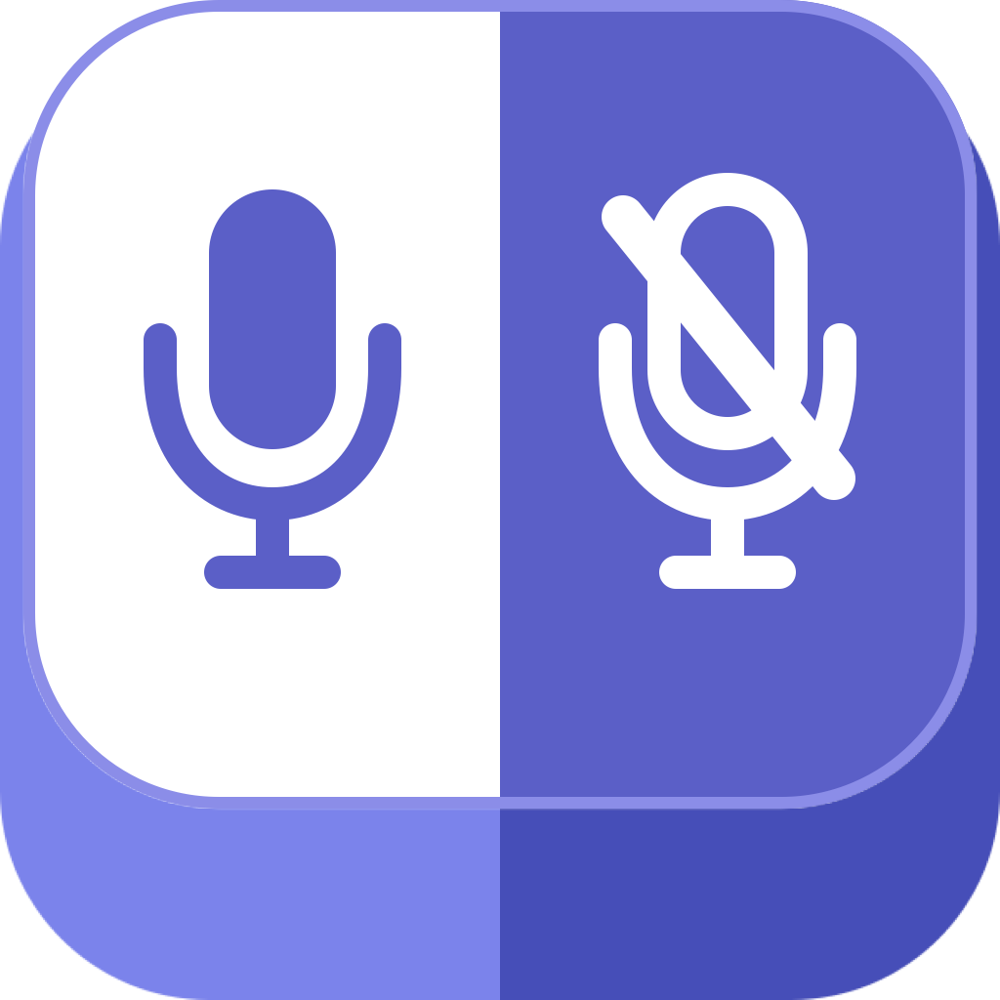

# Microsoft Teams global mute shortcut for macOS

<p align="center">
  
</p>

Toggle mute in Microsoft Teams from any macOS app with a configurable global keyboard shortcut. The default is **Control-Shift-Command-A**.

Teams Mute Helper is a tiny native menu bar app compiled locally from the included Objective-C source. It owns both the global hotkey and Accessibility permission, so the app you are working in never becomes part of the permission chain.

The helper launches at login, remains idle until the hotkey is pressed, and has no microphone or network access.

## Requirements

- macOS 13 or later
- Xcode Command Line Tools (`xcode-select --install`)
- The current Microsoft Teams desktop app (`com.microsoft.teams2`)
- Teams' **Toggle mute** command assigned to **Shift-Command-M**

## Set up

### 1. Install the helper

Clone or download this repository, then run:

```sh
./install-helper.sh
```

The installer:

- compiles and ad-hoc signs `Teams Mute Helper.app` locally;
- installs it in `~/Applications`;
- starts its global hotkey listener; and
- adds a per-user login item so the listener returns after signing in.

You should then see the Teams Mute Helper icon in the menu bar.

### 2. Choose the global shortcut

On the first launch, **Control-Shift-Command-A** is preselected. Click **Use Shortcut** to keep it. To choose another, click **Record a Different Shortcut**, then press one combination.

To change it later, click the helper icon and choose **Keyboard Shortcut…**. In the **Toggle Teams Mute global keyboard shortcut** dialog, nothing is recorded until you click **Record New Shortcut**. The recorder stops listening after one combination so further typing cannot replace it accidentally. Click **Save** to apply it, or **Restore Default** to return to Control-Shift-Command-A.

The choice persists across app and Mac restarts.

### 3. Allow Accessibility access

Open **System Settings → Privacy & Security → Accessibility**, add `~/Applications/Teams Mute Helper.app`, and enable it.

Accessibility is used only to locate the active Teams meeting, deliver Teams' own mute shortcut, verify the result, and restore your previous app.

### 4. Try it

Join a Teams meeting and press your global shortcut from another app. Teams should toggle mute and return focus to the previous app.

### Upgrading from the old Shortcuts version

Shortcuts is not required by the native helper. Remove the global key combination from the old `Toggle Teams Mute` shortcut—or delete that shortcut—so it does not conflict with the helper.

## How it works

1. A per-user login item starts Teams Mute Helper in listener mode.
2. The helper registers your saved shortcut directly with macOS, using **Control-Shift-Command-A** by default.
3. When pressed, it finds the active Teams meeting and reads whether the microphone control says **Mute mic** or **Unmute mic**.
4. When you release the shortcut's main key, it sends Teams' **Shift-Command-M** shortcut directly to the Teams process without waiting for the modifier keys or changing focus.
5. It verifies the mic state as soon as it changes and returns to waiting.

If background delivery does not change the mic state, the helper retries with macOS Accessibility keyboard delivery. Only if both targeted methods fail does it wait for any held modifier keys, briefly bring Teams forward, and retry with system HID delivery before restoring the previous app. It verifies the microphone state after each attempt, so a successful attempt is not toggled a second time. Overlapping hotkey presses are ignored while a toggle is running.

Because the persistent helper receives the global hotkey itself, Shortcuts, Services, Finder, browsers, and editors do not execute the Accessibility automation.

## Menu bar controls

Click the microphone icon to:

- toggle Teams mute without using the keyboard;
- change or restore the global keyboard shortcut;
- open Accessibility settings; or
- quit the helper. Open **Teams Mute Helper** from `~/Applications` to start it again.

## Troubleshooting

### The global hotkey does nothing

Check the menu bar for Teams Mute Helper. If its icon is missing, re-run:

```sh
./install-helper.sh
```

Also remove the chosen key combination from any old Shortcuts shortcut or other hotkey utility. The helper shows a warning icon when macOS reports that the combination is already registered. If a new shortcut conflicts, the helper rejects it and keeps the previous working shortcut.

### Accessibility is enabled, but the helper is not trusted

Turning the entry off and on is sometimes enough. If it is not, fully reset only the helper's Accessibility record:

```sh
tccutil reset Accessibility io.github.m-rk.ms-teams-mute-helper
```

Then return to **System Settings → Privacy & Security → Accessibility**, add `~/Applications/Teams Mute Helper.app` again, and enable it.

Reinstalling rebuilds and re-signs the app locally, so macOS may require this reset after an update.

### Teams focuses but mute does not change

Open **Teams → Settings and more → Keyboard shortcuts** and confirm **Toggle mute** is assigned to **Shift-Command-M**. Fully quit and reopen Teams after changing its shortcut preset.

Microsoft documents **Shift-Command-M** as the macOS mute toggle in its [Teams keyboard shortcut reference](https://support.microsoft.com/en-us/accessibility/teams/keyboard-shortcuts-for-microsoft-teams).

### A Run/Quit window appears

That is the old AppleScript applet. Pull the latest version and re-run `./install-helper.sh`. The current helper is a native menu bar app.

### Collect a local diagnostic

Run the helper without toggling the microphone:

```sh
~/Applications/Teams\ Mute\ Helper.app/Contents/MacOS/TeamsMuteHelper --diagnose
tail -20 ~/Library/Logs/Teams\ Mute\ Helper.log
```

For a logged one-shot toggle, replace `--diagnose` with `--verbose`. Normal menu bar and hotkey runs do not write a log. Each diagnostic or verbose run replaces the previous log.

The log contains helper status, delivery modes, mic state, timestamps, and process identifiers. It does not contain meeting titles, messages, participant names, or audio.

To test the running global-hotkey listener without pressing the physical keys, use:

```sh
~/Applications/Teams\ Mute\ Helper.app/Contents/MacOS/TeamsMuteHelper --test-hotkey --verbose
```

This uses the currently configured global shortcut, deliberately toggles the current meeting once, verifies that Teams' mic state changed, and returns a non-zero status if it did not.

## Optional Shortcuts compatibility

[`toggle-teams-mute.applescript`](toggle-teams-mute.applescript) remains available for existing setups and one-shot automation. It is not used by the menu bar listener. Do not assign it the same global key combination as the helper while the listener is running.

## Uninstall

```sh
./install-helper.sh --uninstall
```

This removes the app and its login item. You can then remove its entry from Accessibility settings.

## Files

- [`install-helper.sh`](install-helper.sh): builds, signs, installs, starts, and removes the menu bar helper.
- [`assets/app-icon.svg`](assets/app-icon.svg), [`assets/app-icon.png`](assets/app-icon.png), and [`assets/AppIcon.icns`](assets/AppIcon.icns): vector source, README image, and macOS bundle icon.
- [`assets/menu-bar-icon.svg`](assets/menu-bar-icon.svg) and [`assets/menu-bar-icon.png`](assets/menu-bar-icon.png): monochrome source and bundled macOS template icon.
- [`TeamsMuteHelper.m`](TeamsMuteHelper.m): owns the global hotkey, activates Teams, sends its mute shortcut, and verifies the state change.
- [`TeamsMuteHelper-Info.plist`](TeamsMuteHelper-Info.plist): defines the native background app bundle.
- [`toggle-teams-mute.applescript`](toggle-teams-mute.applescript): optional compatibility launcher for Shortcuts.

## Limitations

- Teams must be running with a meeting or call open.
- Teams may briefly receive focus if both background delivery methods fail and the helper needs its compatibility fallback.
- The helper targets the current Teams desktop app. Classic Teams uses a different bundle ID.
- A locally rebuilt app may need its Accessibility permission reset after an update.

## Privacy

The helper does not access audio, files, or the network. Accessibility permission is used to search Teams' local accessibility hierarchy for the microphone control, send Teams' mute shortcut, verify the control changed, and restore focus. The menu bar process remains idle between hotkey presses. Normal runs retain no activity data; local diagnostic logging is explicit and contains no meeting content. Nothing is transmitted.

The complete helper source is readable in this repository and is compiled locally during installation.

## License

[MIT](LICENSE)
